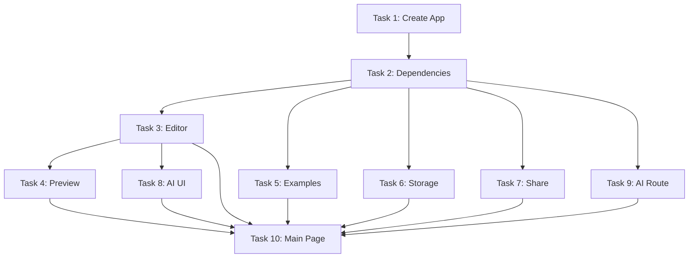

# Tasks: ShepLang Sandbox Alpha

**Plan:** [sandbox-alpha.plan.md](../plans/sandbox-alpha.plan.md)  
**Spec:** [sandbox-alpha.spec.md](../specs/sandbox-alpha.spec.md)  
**Status:** Ready to Execute  
**Location:** `/sheplang/sandbox/`

---

## 📋 Task Overview

**Total Tasks:** 10  
**Estimated Credits:** 13  
**Estimated Time:** 3-4 hours  
**Blocking:** None (can start immediately)

---

## Task 1: Create Next.js Sandbox App

**Status:** ⏭️ READY  
**Credits:** 1.0  
**Time:** 10 minutes

### Commands:
```bash
cd sheplang
npx create-next-app@latest sandbox \
  --typescript \
  --tailwind \
  --app \
  --no-src-dir \
  --import-alias "@/*"
```

### Update Workspace:
Edit `/pnpm-workspace.yaml`:
```yaml
packages:
  - 'sheplang/packages/*'
  - 'adapters/*'
  - 'sheplang/shepkit'
  - 'sheplang/playground'
  - 'sheplang/sandbox'    # ADD THIS
```

### Validation:
- [ ] Sandbox folder created
- [ ] Next.js runs with `pnpm dev`
- [ ] Workspace recognizes sandbox

---

## Task 2: Install All Dependencies

**Status:** ⏳ BLOCKED by Task 1  
**Credits:** 0.5  
**Time:** 5 minutes

### Add to `sandbox/package.json`:
```json
{
  "dependencies": {
    "ai": "^3.4.0",
    "@ai-sdk/openai": "^0.0.66",
    "@ai-sdk/react": "^0.0.66",
    "zod": "^3.23.0",
    "@monaco-editor/react": "^4.6.0",
    "lz-string": "^1.5.0",
    "@sheplang/language": "workspace:*",
    "@adapters/sheplang-to-boba": "workspace:*"
  }
}
```

### Commands:
```bash
cd sandbox
pnpm install
```

### Validation:
- [ ] No dependency conflicts
- [ ] Workspace packages linked
- [ ] `pnpm -w -r build` still passes

---

## Task 3: Implement Monaco Editor

**Status:** ⏳ BLOCKED by Task 2  
**Credits:** 1.5  
**Time:** 20 minutes

### Create: `sandbox/components/SandboxEditor.tsx`

**Key Features:**
- Monaco editor with ShepLang syntax
- Ctrl+Enter to run
- Customizable options
- Responsive height

### ShepLang Keywords:
```typescript
['app', 'data', 'view', 'action', 'fields', 'rules', 'list', 'buttons']
```

### Validation:
- [ ] Editor renders
- [ ] Syntax highlighting works
- [ ] Keyboard shortcuts work

---

## Task 4: Implement Preview Panel

**Status:** ⏳ BLOCKED by Task 3  
**Credits:** 2.0  
**Time:** 30 minutes

### Create: `sandbox/components/SandboxPreview.tsx`

**Key Features:**
- 3 tabs: Preview, BobaScript, AST
- Uses `transpileShepToBoba` from adapter
- Error display
- Debounced transpilation (500ms)

### Validation:
- [ ] Transpilation works
- [ ] Tabs switch correctly
- [ ] Errors show clearly
- [ ] No console errors

---

## Task 5: Add Examples

**Status:** ⏳ BLOCKED by Task 2  
**Credits:** 0.5  
**Time:** 10 minutes

### Create: `sandbox/lib/examples.ts`

**Required Examples:**
1. Minimal Todo
2. Dog Reminder
3. Multi-page App
4. Form Example
5. State Example

### Validation:
- [ ] All examples valid ShepLang
- [ ] Examples cover key features
- [ ] Can switch between examples

---

## Task 6: LocalStorage Management

**Status:** ⏳ BLOCKED by Task 2  
**Credits:** 0.5  
**Time:** 10 minutes

### Create: `sandbox/lib/storage.ts`

**Functions:**
- `saveProject(project)`
- `loadProject(id)`
- `listProjects()`
- `deleteProject(id)`

### Validation:
- [ ] Projects persist on refresh
- [ ] Can save multiple projects
- [ ] No localStorage errors

---

## Task 7: Share Links

**Status:** ⏳ BLOCKED by Task 2  
**Credits:** 0.5  
**Time:** 10 minutes

### Create: `sandbox/lib/share.ts`

**Functions:**
- `encode(state)` - Compress to URL
- `decode(encoded)` - Restore from URL
- `createShareUrl(state)`
- `getStateFromUrl()`

### Validation:
- [ ] Share creates valid URL
- [ ] URL restores exact state
- [ ] Works with large code

---

## Task 8: AI Assistant UI

**Status:** ⏳ BLOCKED by Task 3  
**Credits:** 1.5  
**Time:** 25 minutes

### Create: `sandbox/components/AIAssistant.tsx`

**Features:**
- 3 modes: Explain, Generate, Fix
- useChat hook integration
- Message history
- Insert code button
- Loading states

### Validation:
- [ ] All buttons work
- [ ] Messages display
- [ ] Code insertion works
- [ ] Responsive layout

---

## Task 9: AI API Route

**Status:** ⏳ BLOCKED by Task 2  
**Credits:** 2.0  
**Time:** 30 minutes

### Create: `sandbox/app/api/ai/sandbox/route.ts`

**Requirements:**
- Zod validation
- 3 system prompts
- OpenAI GPT-4o
- Stream responses
- Error handling

### Environment:
```bash
OPENAI_API_KEY=sk-...
```

### Validation:
- [ ] All modes work
- [ ] Streaming works
- [ ] Errors handled gracefully
- [ ] ShepLang-only responses

---

## Task 10: Main Page Integration

**Status:** ⏳ BLOCKED by Tasks 3-8  
**Credits:** 2.0  
**Time:** 30 minutes

### Update: `sandbox/app/page.tsx`

**Layout:**
```
Header (Logo | Examples | Share | AI Toggle)
Editor (50%) | Preview (25%) | AI (25%)
```

**Features:**
- Example selector
- Share button
- AI panel toggle
- Responsive layout

### Final QA:
- [ ] Editor → Preview flow works
- [ ] AI generates valid ShepLang
- [ ] Examples load correctly
- [ ] Share links work
- [ ] No console errors
- [ ] `pnpm -w -r build` passes

---

## 🎯 Execution Order



---

## ✅ Definition of Done

### Sandbox Alpha is DONE when:
1. ✅ Deployed to Vercel
2. ✅ Editor with ShepLang syntax
3. ✅ Live preview working
4. ✅ AI assistant functional (3 modes)
5. ✅ 5 examples available
6. ✅ Share links work
7. ✅ localStorage projects
8. ✅ No backend required
9. ✅ Founder can build in < 10 minutes

---

## 🚨 Emergency Rollback

If anything breaks:
```bash
# Remove sandbox completely
rm -rf sheplang/sandbox

# Remove from workspace
# Edit pnpm-workspace.yaml, remove sandbox line

# Verify core still works
pnpm -w -r build
pnpm run verify
```

---

## 📝 Notes

**Remember:**
- This replaces ShepKit as Phase 1
- Keep it simple (no auth, no backend)
- Focus on "wow in 10 minutes"
- AI must be ShepLang-only
- Don't modify core packages

**Success looks like:**
> "A founder types plain English, gets ShepLang code, sees it work, and shares it with investors — all in one browser tab."

---

**Ready to Execute:** YES  
**Start with:** Task 1  
**Total Time:** 3-4 hours
